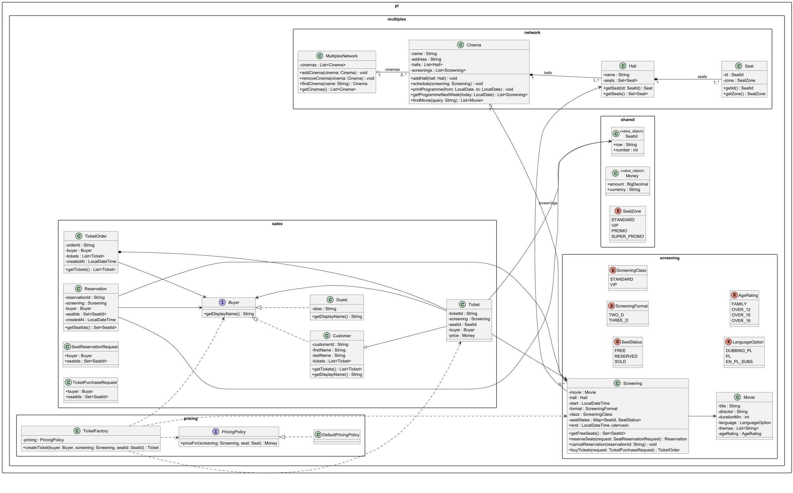

# Dokumentacja działania systemu Multiplex


## Opis ogólny

System modeluje sieć multipleksów kinowych działających w ramach jednego systemu.
Obsługuje strukturę kin, repertuar, seanse, rezerwacje miejsc oraz zakup biletów.

Zakres obejmuje wyłącznie logikę biznesową:

* brak GUI,
* brak bazy danych,
* brak płatności online.

Najważniejsze założenia modelu:

* **Hall + Seat** reprezentują fizyczną strukturę kina.
* **Screening** reprezentuje wydarzenie w czasie oraz stan miejsc.
* **Buyer** jest rolą kupującego (Customer albo Guest).

Pakiety są podzielone domenowo:

```
pl.multiplex.network
pl.multiplex.screening
pl.multiplex.sales
pl.multiplex.pricing
pl.multiplex.shared
```

---

# Pakiet: pl.multiplex.shared

## enum SeatZone

Określa strefę miejsca:

STANDARD, VIP, PROMO, SUPER_PROMO

## class SeatId <<value object>>

Identyfikator miejsca w sali.

row : String
number : int

## class Money <<value object>>

Reprezentuje wartość pieniężną.

amount : BigDecimal
currency : String

---

# Pakiet: pl.multiplex.network

## class MultiplexNetwork

Reprezentuje całą sieć kin.

Pola:
cinemas : List<Cinema>

Metody:
addCinema()
removeCinema()
findCinema()
getCinemas()

---

## class Cinema

Jedno kino w konkretnej lokalizacji.

Pola:
name : String
address : String
halls : List<Hall>
screenings : List<Screening>

Metody:
addHall()
schedule()
printProgramme()
getProgrammeNextWeek()
findMovie()

---

## class Hall

Sala kinowa.

Pola:
name : String
seats : Set<Seat>

Metody:
getSeat()
getSeats()

---

## class Seat

Pojedyncze miejsce w sali.

Pola:
id : SeatId
zone : SeatZone

Metody:
getId()
getZone()

---

# Pakiet: pl.multiplex.screening

## enum SeatStatus

Status miejsca w kontekście seansu.

FREE, RESERVED, SOLD

## enum ScreeningFormat

Format projekcji.

TWO_D, THREE_D

## enum ScreeningClass

Typ seansu.

STANDARD, VIP

## enum LanguageOption

Opcja językowa filmu.

DUBBING_PL, PL, EN_PL_SUBS

## enum AgeRating

Kategoria wiekowa filmu.

FAMILY, OVER_12, OVER_16, OVER_18

---

## class Movie

Film znajdujący się w repertuarze.

Pola:
title : String
director : String
durationMin : int
language : LanguageOption
themes : List<String>
ageRating : AgeRating

---

## class Screening

Seans filmu – centralny element logiki systemu.

Pola:
movie : Movie
hall : Hall
start : LocalDateTime
format : ScreeningFormat
clazz : ScreeningClass
seatStates : Map<SeatId, SeatStatus>
end : LocalDateTime <<derived>>

Metody:
getFreeSeats()
reserveSeats()
cancelReservation()
buyTickets()

Screening przechowuje stan miejsc niezależnie od fizycznej sali.

---

# Pakiet: pl.multiplex.sales

## interface Buyer

Reprezentuje rolę kupującego.

Metoda:
getDisplayName()

---

## class Customer implements Buyer

Kupujący posiadający konto.

Pola:
customerId : String
firstName : String
lastName : String
tickets : List<Ticket>

Metody:
getTickets()
getDisplayName()

---

## class Guest implements Buyer

Kupujący bez konta.

Pola:
alias : String

Metody:
getDisplayName()

---

## class Reservation

Rezerwacja miejsc na seans.

Pola:
reservationId : String
screening : Screening
buyer : Buyer
seatIds : Set<SeatId>
createdAt : LocalDateTime

Metody:
getSeatIds()

---

## class Ticket

Bilet przypisany do konkretnego miejsca i seansu.

Pola:
ticketId : String
screening : Screening
seatId : SeatId
buyer : Buyer
price : Money

---

## class TicketOrder

Zamówienie grupujące bilety zakupione jednocześnie.

Pola:
orderId : String
buyer : Buyer
tickets : List<Ticket>
createdAt : LocalDateTime

Metody:
getTickets()

---

## class SeatReservationRequest

Obiekt wejściowy używany przy rezerwacji miejsc.

buyer : Buyer
seatIds : Set<SeatId>

---

## class TicketPurchaseRequest

Obiekt wejściowy używany przy zakupie biletów.

buyer : Buyer
seatIds : Set<SeatId>

---

# Pakiet: pl.multiplex.pricing

## interface PricingPolicy

Strategia wyliczania ceny biletu.

priceFor(screening, seat) : Money

---

## class DefaultPricingPolicy

Domyślna implementacja polityki cenowej.

---

## class TicketFactory

Fabryka odpowiedzialna za tworzenie biletów.

Pola:
pricing : PricingPolicy

Metody:
createTicket()

Fabryka korzysta z PricingPolicy, aby ustalić cenę biletu podczas jego tworzenia.

---

# Jak działa cały system (flow)

1. Tworzony jest MultiplexNetwork i dodawane są Cinema.

2. Cinema posiada Hall, a Hall posiada Seat.

3. Dodawane są Movie oraz planowane Screening.

4. Buyer (Customer albo Guest) wybiera seans.

5. Możliwe działania:

    * rezerwacja miejsc → Reservation
    * zakup biletów → TicketOrder + Ticket

6. Screening zarządza statusem miejsc (FREE / RESERVED / SOLD).

7. TicketFactory wykorzystuje PricingPolicy do wyliczenia ceny.

---

# Zastosowane zasady projektowe

System wykorzystuje podstawowe zasady SOLID i wzorce projektowe:

* Buyer jako interfejs — polimorfizm ról kupującego.
* PricingPolicy — wzorzec Strategy.
* TicketFactory — wzorzec Factory.
* SeatId oraz Money — Value Objects.
* Podział na pakiety domenowe zamiast pakietów technicznych.
